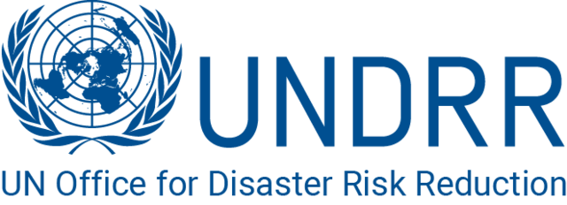
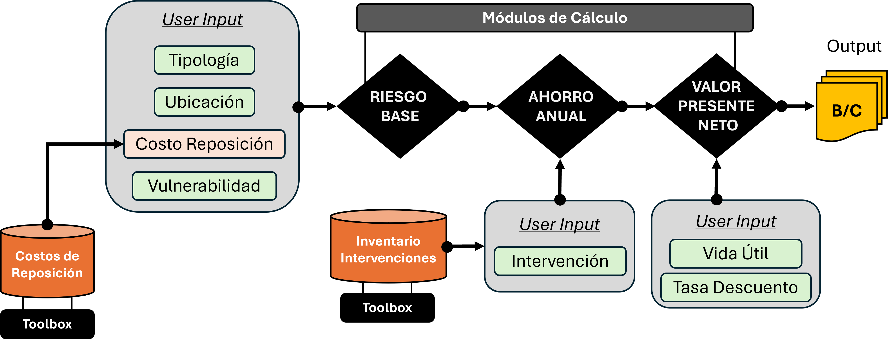

# Herramienta de Análisis Costo-Beneficio (CBA) para Inversiones Resilientes 🇨🇷

  

Este repositorio aloja la **Herramienta de Priorización de Inversiones** desarrollada en el marco de la consultoría para la **Oficina de las Naciones Unidas para la Reducción del Riesgo de Desastres (UNDRR)** y el Programa de Emergencia para la Reconstrucción Integral (PROERI) en Costa Rica.

## 🎯 Objetivo

El propósito de esta herramienta es dotar al Gobierno de Costa Rica y a las unidades ejecutoras (CNE, MIDEPLAN) de un instrumento cuantitativo para evaluar la rentabilidad financiera y social de proyectos de mitigación de desastres.

La herramienta permite:

1. **Estimar el Riesgo Probabilista:** Calcula la Pérdida Anual Promedio (AAL) utilizando datos del Marco Global de Evaluación de Riesgos (GRAF).
2. **Comparar Escenarios:** Evalúa el retorno de inversión de diferentes intervenciones (ej. Reforzamiento vs. Reconstrucción).
3. **Valorar la Sostenibilidad:** Monetiza el beneficio ambiental por "Carbono Evitado" al prevenir la destrucción de infraestructura.

## 📂 Contenido del Repositorio

* `Herramienta_CBA_v3.1.xlsx`: La herramienta funcional en Excel (Macro-free). Contiene las bases de datos de riesgo por cantón, catálogo de intervenciones y dashboard de resultados.
* `Entregable_4_Informe_Herramienta_CBA.pdf`: Manual técnico y guía de usuario detallada.

## 🚀 Guía Rápida de Uso

Para utilizar la herramienta, descargue el archivo `.xlsx` y siga estos pasos en la hoja "Input":

1. **Defina el Activo:** Seleccione la **Provincia**, **Cantón** y **Sector** (Educación, Salud, Residencial, Transporte). La herramienta cargará automáticamente el perfil de amenaza de la zona.
2. **Establezca la Línea Base:** Ingrese el **Valor de Reposición** del activo y su **Vulnerabilidad** actual (Alta/Media/Baja).
3. **Seleccione una Intervención:** Elija una estrategia de la lista desplegable (ej. *Reforzamiento Estructural*). La herramienta calculará el costo de obra y la reducción de riesgo estimada.
4. **Analice los Resultados:** Revise el **Valor Presente Neto (VPN)** y la relación **Beneficio/Costo (B/C)**.
   * `B/C > 1.0`: El proyecto es financieramente viable por ahorro de riesgo.

## 📊 Metodología

La herramienta utiliza un enfoque probabilista, integrando:

* **Riesgo:** Estimados de pérdidas económicas anualizadas basadas en datos del GRAF (Global Risk Assessment Framework).
* **Amenaza:** Resultados disponibles para terremotos e inundaciones
* **Exposición:** Bases de datos de activos expuestos por cantón para los sectores: Vivienda, Educación, Salud, Infraestructura (carreteras)
* **Vulnerabilidad:** Muestreo de pérdidas probables ajustadas por tipología y estado del activo.
* **Impacto Socio-Ambiental:** Tasa de descuento y precio social del carbono ($40/ton CO2e).

A continuación se muestra un diagrama del flujo de cálculo de la herramienta:

## ⚠️ Requisitos

* Microsoft Excel 2016 o superior.
* No requiere macros ni plugins externos.

## 📜 Licencia

Este proyecto está bajo la Licencia **Creative Commons Atribución-NoComercial-CompartirIgual 4.0 Internacional (CC BY-NC-SA 4.0)**.

Usted es libre de:
* **Compartir** — copiar y redistribuir el material en cualquier medio o formato.
* **Adaptar** — remezclar, transformar y construir a partir del material.

Bajo los siguientes términos:
* **Atribución** — Usted debe dar crédito de manera adecuada, brindar un enlace a la licencia, e indicar si se han realizado cambios.
* **NoComercial** — Usted no puede hacer uso del material con propósitos comerciales.
* **CompartirIgual** — Si remezcla, transforma o crea a partir del material, debe distribuir su contribución bajo la misma licencia del original.

Para ver una copia de esta licencia, visite [https://creativecommons.org/licenses/by-nc-sa/4.0/deed.es](https://creativecommons.org/licenses/by-nc-sa/4.0/deed.es).

## 📄 Créditos y Autoría

**Desarrollado por:**
* **Andrés Abarca Jiménez PhD** - ATLAS Consulting (Consultor Principal)

**Supervisión:**
* **UN Office for Disaster Risk Reduction (UNDRR)** - Oficina Regional para las Américas y el Caribe.

*Esta herramienta es de uso público para apoyar la toma de decisiones en gestión de riesgo de desastres. Los autores no se hacen responsables por decisiones tomadas únicamente con base en este análisis.*

